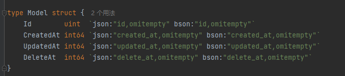
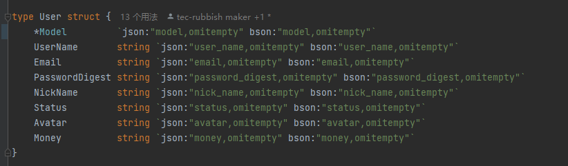
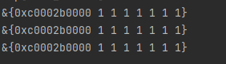
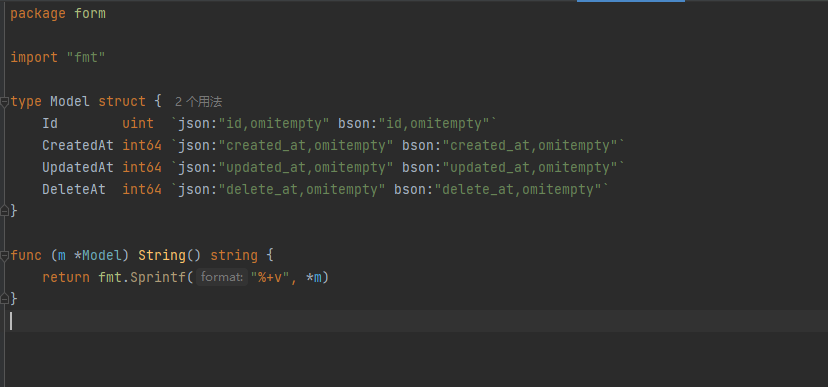
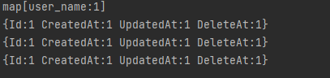
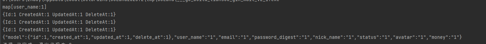

我在一个结构体中添加了一个内嵌结构体

如果我没有给这个结构体添加String方法的时候,直接打印一个User结构体打印出*Model的地址和其他成员的值

但是如果给Model添加了String方法,则在打印的时候Model的String打印会直接覆盖掉外面User结构体的打印

在使用json.Marshal方法后,打印得到的data输出是很正常的

想问一下这种情况下,除了给外部的结构体添加String方法,或者弃用Model结构体,有没有什么更好的方法可以解决这种String方法被覆盖的情况呢